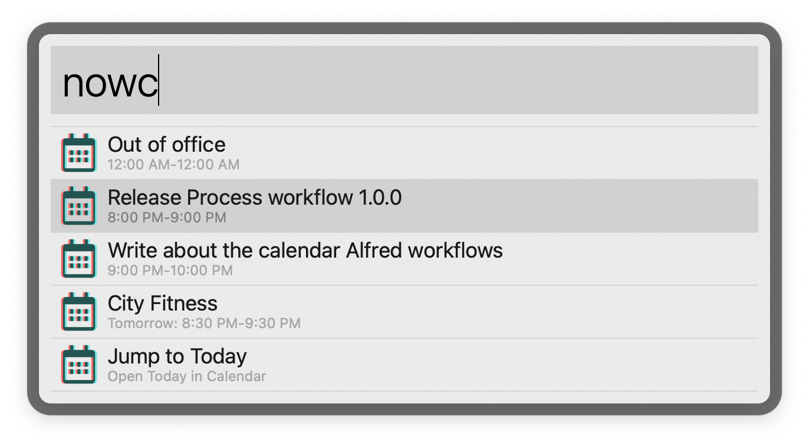
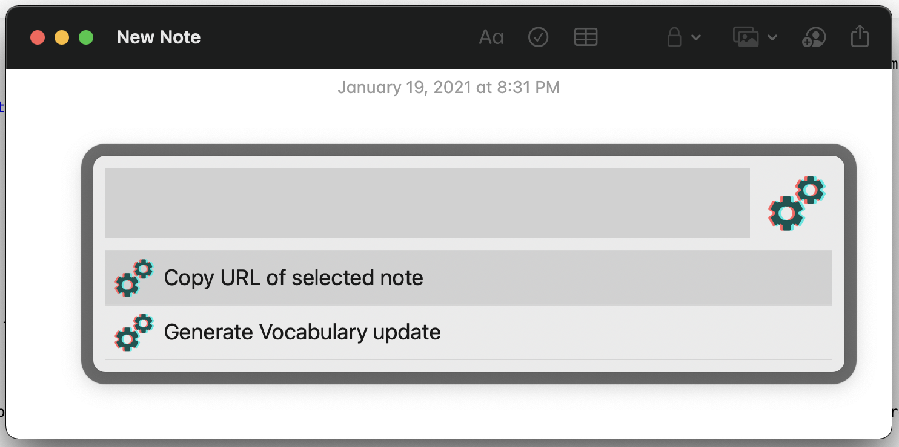

# Process

Process is a mega workflow for [Alfred](https://www.alfredapp.com) that contains a bunch of custom automations that I (Artem Chistyakov, [temochka.com](https://temochka.com)) built over the years.

## Calendar 

### Jump to event

Type `nowc` into Alfred to get a list of current and upcoming events on your calendar and quickly open them in Calendar app.

### Jump to relevant link

Type `nowl` into Alfred to get a list of links mentioned in current and upcoming events’ descriptions. Useful for quickly joining Zoom calls or jumping to time-blocked OmniFocus tasks.

<!-- End Calendar -->

## Notes

### Jump to daily note

Type `nown` into Alfred to jump to a daily note in "🗓 Daily Notes" folder. Creates the note if doesn't exist.

### Selection to OmniFocus task

**Experimental.** Select any text in an edited note and turn it into a link to a new OmniFocus task. An additional bi-directional link between the note and the task is created via [Hook](https://hookproductivity.com).

<!-- End Notes -->

## GitHub

### Jump to repository

Type `gh <repo>` jump to one of your repositories on GitHub. Blazing fast, makes no API queries in real-time, allows for fuzzy-searching. Set `GITHUB_TOKEN` to a token with repository access in workflow settings. Use `gh-refresh` to periodically refresh the cache.

<!-- End GitHub -->

## Custom searches

I like to add my searches as workflows because it makes it easier to sync them across multiple machines (I don’t use Dropbox sync).

### Rubygems.org

Type `gem <query>` to jump to a gem on Rubygems.org.

<!-- End searches -->

## Misc

## AppleScript launcher

Run a registered AppleScript automation for the currently focused app. Requires the `SCRIPTS_DIR` variable to be set. The specified directory should be structured in the following way: each supported app gets a subdirectory named after its bundle id, inside are the scripts accompanied by a `launcher.json` file written in Alfred’s [Script Filter](https://www.alfredapp.com/help/workflows/inputs/script-filter/) format. See [my AppleScript collection](https://github.com/temochka/macos-automation/tree/master/applescript) for an example.

### Browser shortcut

Press <kbd>⌥</kbd>+<kbd>⇧</kbd>+<kbd>\\</kbd> to launch the default browser. Useful if you use diffrent default browsers on different machines and always forget which one is which.

### Image sharing

Clip a screenshot (<kbd>⌘</kbd>+<kbd>⌃</kbd>+<kbd>⇧</kbd>+<kbd>4</kbd> or <kbd>⌘</kbd>+<kbd>⌃</kbd>+<kbd>⇧</kbd>+<kbd>3</kbd>), then type `imglink` keyword into Alfred to upload the image and paste the link.
Alternatively, invoke the workflow as a [File Action](https://www.alfredapp.com/blog/tips-and-tricks/file-actions-from-alfred-or-finder/) for any file.

The workflow requires the following workflow variables to be set in Alfred:

* `IMAGE_UPLOAD_HOSTNAME` - the hostname for your image hosting server, e.g. `images.example.org`;
* `IMAGE_UPLOAD_SSH_HOSTNAME` - the hostname that provides SSH access to your image hosting server’s filesystem;
* `IMAGE_UPLOAD_SSH_USER` - the SSH user to use when connecting to the server;
* `IMAGE_UPLOAD_WEBROOT_PATH` - the server path where to put the uploaded file;
