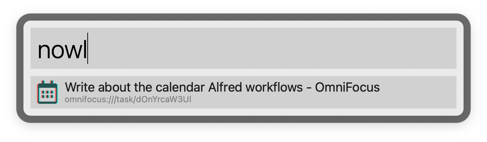
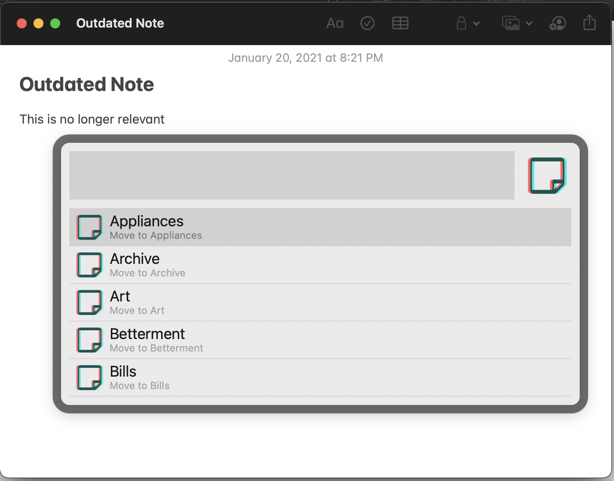

# macOS automation scripts

A collection of my macOS automation scripts (Alfred workflow, AppleScript and JXA). To compile, run:

``` bash
make all
```

## AlfredProcess

A mega-workflow for [Alfred](https://www.alfredapp.com) that encompasses all of my custom automations. See its own [README](AlfredProcess/README.md) for details. To build just the workflow, run:

``` bash
make alfred-workflow
```

Then install the workflow via:

``` bash
open target/Process.alfredworkflow
```

<!-- End AlfredProcess -->

## Hotkeys

I use an app I built called [Anykey](https://github.com/temochka/Anykey) to assign hotkeys to some of the automations. The Anykey configuration file is automatically built from individual launchers.

<!-- End Hotkeys -->


## Calendar

### Jump to upcoming event

Type `nowc` into Alfred to get a list of current and upcoming events on your calendar and quickly open them in Calendar app.


### Jump to relevant link

Type `nowl` into Alfred to get a list of links mentioned in current and upcoming events’ descriptions. Useful for quickly joining Zoom calls or jumping to time-blocked OmniFocus tasks.



<!-- End Calendar -->

## Contacts

### Open in Alfred

Contacts app is awkward to navigate with the keyboard so this is convenient for quickly copying fields to clipboard.

### Link to Contact

Insert a link to another contact via Alfred search. Creates a bi-directional link via Hook app.

<!-- End Contacts -->

## Mail

### Copy Mail message URL

Copies local URLs to messages in Apple Mail for quick referencing. URLs look like below and work both on macOS and iOS:

```
message://%3c20200219T233150.531069615694520168.noreply@letsencrypt.org%3e
```


<!-- End Mail -->

## Notes

### Next / previous note

Annoyingly, there’s no shortcut in Notes to go to next or previous note. This script fixes it. Press <kbd>⌘</kbd>+<kbd>⇧</kbd>+<kbd>[</kbd> or <kbd>⌘</kbd>+<kbd>⇧</kbd>+<kbd>[</kbd> (like Safari tabs) to navigate between notes in sidebar.

### Open Note URL / Copy Note URL

Apple Notes doesn’t provide URLs that work reliably across devices. I link to my notes using the following URLs format

```
shortcuts://run-shortcut?name=NoteURL&input=1582228319
```

This format works both on macOS (via these scripts) and iOS (via custom shortcuts) and relies on note creation date, which is
extremely reliable and unlikely to change.

### Generate Vocabulary Update

Whenever I see an unknown English word, I add it to a note in "🇬🇧English" folder. This script combine these separate notes into a single list that I can load into my space repetition software.

### Move selected note(s)

Press a keyboard shortcut (e.g., <kbd>⌥</kbd>+<kbd>⇧</kbd>+<kbd>M</kbd>) to move one or more selected notes to a chosen destination folder.



### Jump to daily note

Type `nown` into Alfred to jump to a daily note in "🗓 Daily Notes" folder. Creates the note if doesn't exist.

### Link to a note

Insert a link to another note via Alfred search. Create a bi-directional link via Hook app.

### Selection to OmniFocus task

**Experimental.** Select any text in an edited note and turn it into a link to a new OmniFocus task. An additional bi-directional link between the note and the task is created via [Hook](https://hookproductivity.com).

<!-- End Notes -->

## OmniFocus

### Link to an OmniFocus task

Insert a link to another OmniFocus task via Alfred search. Create a bi-directional link via Hook app.

### Time block

Block an hour starting now on the “Time Blocks” calendar for the selected task or project. Back-link the task from the created event, then show it in Calendar. Can then use <kbd>⌃</kbd>+<kbd>⌥</kbd>+<kbd>Down</kbd> / <kbd>⌃</kbd>+<kbd>⌥</kbd>+<kbd>Up</kbd> to move the event around.

<!-- End OmniFocus -->

## Safari

### Open Highlighted Link

Safari doesn’t automatically focus elements highlighted via search by page (like Chrome or Firefox). However, it can be done with a bit of AppleScript. [Read more](https://temochka.com/blog/posts/2018/12/18/navigating-the-web-safari.html) on my blog.

### Safari tab to OmniFocus

I could never figure out how to quickly add a Safari web page to OmniFocus (so it puts the page title into task and URL as a note) so I wrote this shortcut. Works for me!

<!-- End Safari -->